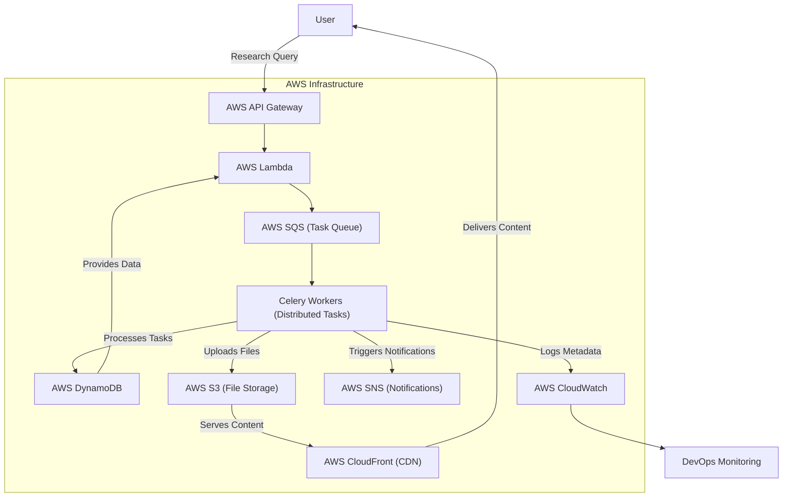

# KnowledgeNet

KnowledgeNet is an AI-driven framework designed to automate the research process by collecting, processing, and presenting information from various online sources. It leverages advanced web crawling, natural language processing, and data visualization techniques to deliver comprehensive research insights.

## Features

- **Automated Web Crawling**: Utilize [Crawl4AI](https://github.com/sohamw03/Crawl4AI) with Playwright for efficient data extraction.
- **Natural Language Processing**: Employ large language models (LLMs) for data analysis and summarization.
- **Interactive Dashboard**: Visualize research findings through an intuitive React/Next.js frontend.
- **Scalability**: Implement Celery with message brokers for distributed task management.
- **Cloud Integration**: Deploy using AWS services for robust and scalable infrastructure.

## Architecture Overview



## Installation

1.  **Install UV - Package Manager (Recommended)**

    [https://docs.astral.sh/uv/getting-started/installation/](https://docs.astral.sh/uv/getting-started/installation/)

    **Install Bun - Package Manager (Recommended)**

    [https://bun.sh/docs/installation](https://bun.sh/docs/installation)

2.  **Clone the repository**

    ```bash
    git clone https://github.com/sohamw03/knowledge_net.git
    cd knowledge_net
    ```

3.  **Backend Setup:**

    Navigate to the backend directory:

    ```bash
    cd backend
    ```

    Create virtual environment and install dependencies:
    ```bash
    uv sync
    ```

    Activate the virtual environment:
    ```bash
    source .venv/bin/activate # For Linux/Mac
    .venv\Scripts\activate # For Windows
    ```

    Install playwright chromium:
    ```bash
    playwright install chromium --with-deps
    ```

    Add environment variables to `.env` file:
    ```bash
    cp .env.example .env
    ```


3.  **Frontend Setup:**

    Navigate to the frontend directory:
    ```bash
    cd ../frontend
    ```

    Install the dependencies:
    ```bash
    bun install --force
    ```

    Add environment variables to `.env` file:
    ```bash
    cp .env.example .env

## Usage

1.  **Start the Backend:**

    Ensure you're in the backend directory and the virtual environment is activated.

    Run the Flask-SocketIO asynchronous server:
    ```bash
    uvicorn app:app --host 0.0.0.0 --port 5000
    ```

2.  **Start the Frontend:**

    In a new terminal, navigate to the frontend directory.

    Start the development server:

    ```bash
    bun dev
    ```

3.  **Access the Application:**

    Open your browser and navigate to `http://localhost:3000` to interact with KnowledgeNet.

## Contributing

We welcome contributions to enhance KnowledgeNet. To contribute:

1.  Fork the repository.
2.  Create a new branch:

    ```bash
    git checkout -b feature/YourFeatureName
    ```

3.  Commit your changes:

    ```bash
    git commit -m 'Add some feature'
    ```

4.  Push to the branch:

    ```bash
    git push origin feature/YourFeatureName
    ```

5.  Open a pull request detailing your changes.

## License

This project is licensed under the Apache-2.0 License. See the `LICENSE` file for more details.
